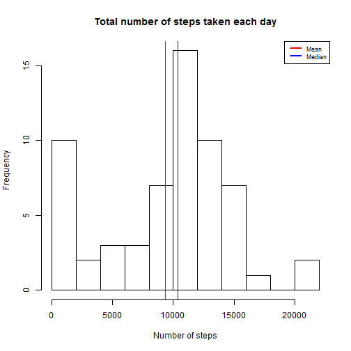

##Loading and prerocessing the data

For loading the data we use the simple `read.csv` command and store it into a table named `steps`:


```r
steps<-read.csv("activity.csv")
```

Let us look at the head and tail of the data.


```r
head(steps)
```

```
##   steps       date interval
## 1    NA 2012-10-01        0
## 2    NA 2012-10-01        5
## 3    NA 2012-10-01       10
## 4    NA 2012-10-01       15
## 5    NA 2012-10-01       20
## 6    NA 2012-10-01       25
```

```r
tail(steps)
```

```
##       steps       date interval
## 17563    NA 2012-11-30     2330
## 17564    NA 2012-11-30     2335
## 17565    NA 2012-11-30     2340
## 17566    NA 2012-11-30     2345
## 17567    NA 2012-11-30     2350
## 17568    NA 2012-11-30     2355
```

Let us get a better insight at the data by looking at the structure of the table.


```r
str(steps)
```

```
## 'data.frame':	17568 obs. of  3 variables:
##  $ steps   : int  NA NA NA NA NA NA NA NA NA NA ...
##  $ date    : Factor w/ 61 levels "2012-10-01","2012-10-02",..: 1 1 1 1 1 1 1 1 1 1 ...
##  $ interval: int  0 5 10 15 20 25 30 35 40 45 ...
```

We are not getting much insight about the first column `steps`. Let us check if it consists of only NA by looking at the fraction of values which are not NA. For this we will use the `is.na` function.


```r
sum(!is.na(steps[,"steps"]))/length(steps[,"steps"])
```

```
## [1] 0.8688525
```

Clearly, the dataset is not entirely NAs. Let us make it more useable. The other two columns are clearly the date and time column. Also, the second one is in `%H%M` format and the date is in `%Y-%m-%d` format. Let us convert these two tables into `POSIXlt` format.Let us add a new column to the data table to facilitate this.


```r
steps$time<-paste(steps[,"date"], " ", as.integer(steps[,"interval"]/100), ":", as.integer(steps[,"interval"])-as.integer(as.integer(steps[,"interval"])/100L)*100,":00", sep="")
```

Let us have a look at the updates.


```r
head(steps)
```

```
##   steps       date interval               time
## 1    NA 2012-10-01        0  2012-10-01 0:0:00
## 2    NA 2012-10-01        5  2012-10-01 0:5:00
## 3    NA 2012-10-01       10 2012-10-01 0:10:00
## 4    NA 2012-10-01       15 2012-10-01 0:15:00
## 5    NA 2012-10-01       20 2012-10-01 0:20:00
## 6    NA 2012-10-01       25 2012-10-01 0:25:00
```

Now, we convert the time column into `POSIXlt` format. 


```r
steps$time<-as.POSIXlt(strptime(steps$time,"%Y-%m-%d %H:%M:%S"))
```

Lets have a look at the new structure of the table:


```r
str(steps)
```

```
## 'data.frame':	17568 obs. of  4 variables:
##  $ steps   : int  NA NA NA NA NA NA NA NA NA NA ...
##  $ date    : Factor w/ 61 levels "2012-10-01","2012-10-02",..: 1 1 1 1 1 1 1 1 1 1 ...
##  $ interval: int  0 5 10 15 20 25 30 35 40 45 ...
##  $ time    : POSIXlt, format: "2012-10-01 00:00:00" "2012-10-01 00:05:00" ...
```


## What is mean total number of steps taken per day?


Let us first store the dates into a vector using the levels functions as the `dates` columns of the data frame `steps` is already in class factors. 


```r
  dates<-levels(steps$date)
```

Now, we calculate the total number of steps taken per day.


```r
  nsteps<-rep(NA,length(dates))

  for(i in 1:length(dates)){
    nsteps[i]<-sum(steps$steps[which(steps$date==dates[i],arr.ind=TRUE)],na.rm=TRUE)
  }

  nsteps<-cbind(dates,nsteps)
  nsteps<-data.frame(nsteps)
  nsteps$nsteps<-as.integer(as.character(nsteps$nsteps))
  nsteps$dates<-as.Date(as.character(dates),format = "%Y-%m-%d")
```

The resulting table `nsteps` has the dates and the number of steps for those dates, as follows:


```r
  head(nsteps)
```

```
##        dates nsteps
## 1 2012-10-01      0
## 2 2012-10-02    126
## 3 2012-10-03  11352
## 4 2012-10-04  12116
## 5 2012-10-05  13294
## 6 2012-10-06  15420
```

Let us now plot the histogram, with red line representing mean and the blue one the median.


```r
hist(nsteps$nsteps,breaks=10,xlab="Number of steps", main="Total number of steps taken each day")
abline(v=median(nsteps$nsteps),col="blue")
abline(v=mean(nsteps$nsteps),col="red")
legend("topright", col=c("red", "blue"), lwd=2,legend=c("Mean", "Median"), cex=0.75)
```

 

The mean and median of the total number of steps taken each day are respectively as follows:


```r
nsteps.mean<-mean(nsteps$nsteps)
nsteps.mean
```

```
## [1] 9354.23
```

```r
nsteps.median<-median(nsteps$nsteps)
nsteps.median
```

```
## [1] 10395
```

Thus the mean and median of the total number of steps taken each day are 9354.2295082 and 10395 respectively.

##What is the average daily activity pattern?

We first need to make a table with the average number of steps taken over a 5 minutes interval, averaged over all days. Let us store the five minue intervals in a vector:


```r
intervals<-unique(steps$interval)
```

Then we use a for loop to get the averages.


```r
ansteps<-rep(NA,length(intervals))

for(i in 1:length(intervals)){
  ansteps[i]<-mean(steps$steps[which(steps$interval==intervals[i],arr.ind=TRUE)],na.rm=TRUE)
}

ansteps<-cbind(intervals,ansteps)
ansteps<-data.frame(ansteps)
```

Let us plot the time series plot:


```r
plot(ansteps,type="l", xlab="5-minute intervals", ylab="Average number of steps", main="Average Daily Activity")
```

 

To get the interval with the maximum average let us look at the maximum of ansteps from the above table.


```r
ansteps.max<-ansteps[which(ansteps$ansteps==max(ansteps$ansteps),arr.ind=TRUE),"intervals"]
ansteps.max
```

```
## [1] 835
```

So, the maximum number of steps were taken at 835 hours.


#Imputing missing values

Like we have calculated the number of the non-missing values above. Let us now look at the number of missing values. 


```r
nsteps.na<-sum(is.na(steps[,"steps"]))
```

So, we have `nsteps.na` number of missing values. 

###Imputation strategy of missing data
We can replace them with the median of the value at that particular interval. It will take care of the outliers also. Let us do this and save the results in a new data set `steps.na.rm`


```r
steps.na.rm<-steps

for(i in 1:dim(steps)[1]){
  
  if(is.na(steps[i,"steps"])){
    steps.na.rm[i,"steps"]<-median(steps[which(steps[,"interval"]==steps[i,"interval"],arr.ind=TRUE),"steps"],na.rm=TRUE)

  }
}
```

So, the new data set with the missing values removed looks something like this:


```r
head(steps.na.rm)
```

```
##   steps       date interval                time
## 1     0 2012-10-01        0 2012-10-01 00:00:00
## 2     0 2012-10-01        5 2012-10-01 00:05:00
## 3     0 2012-10-01       10 2012-10-01 00:10:00
## 4     0 2012-10-01       15 2012-10-01 00:15:00
## 5     0 2012-10-01       20 2012-10-01 00:20:00
## 6     0 2012-10-01       25 2012-10-01 00:25:00
```


Let us look at the histogram of total number of steps taken daily, with the analysis done above.


```r
  nsteps1<-rep(NA,length(dates))

  for(i in 1:length(dates)){
    nsteps1[i]<-sum(steps.na.rm$steps[which(steps.na.rm$date==dates[i],arr.ind=TRUE)])
  }

  nsteps1<-cbind(dates,nsteps1)
  nsteps1<-data.frame(nsteps1)
  nsteps1$nsteps1<-as.integer(nsteps1$nsteps1)
  nsteps1$dates<-as.Date(dates,format = "%Y-%m-%d")
```


The histogram is as follows with red line representing mean and the blue one the median.


```r
hist(nsteps1$nsteps1,breaks=10,xlab="Number of steps", main="Total number of steps taken each day")
abline(v=median(nsteps1$nsteps1),col="blue")
abline(v=mean(nsteps1$nsteps1),col="red")
legend("topright", col=c("red", "blue"), lwd=2,legend=c("Mean", "Median"), cex=0.75)
```

 

The new values of mean and median are as follows:


```r
nsteps1.mean<-mean(nsteps1$nsteps1)
nsteps1.mean
```

```
## [1] 25.95082
```

```r
nsteps1.median<-median(nsteps1$nsteps1)
nsteps1.median
```

```
## [1] 24
```

So, the new values of mean and median which are 25.9508197 and 24 respectively. The value of mean increased and the median remained the same. 

The impact of this imputation on the estimates of the total daily number of steps varies. While we are essentially creating a walking pattern for a day from the observation on other days, we are re
ally just adding numbers where there is none. 


##Are there differences in activity patterns between weekdays and weekends?


Let us create a new column for the day of the week for the given dates.


```r
steps.na.rm$day<-weekdays(steps.na.rm$time)
```

Let us convert this into a factor variable indicating whether the day is a weekday or a weekend.


```r
steps.na.rm$day<-as.factor(sapply(steps.na.rm$day, function(x)ifelse(x=="Sunday"|x=="Saturday","Weekend","Weekday")))
```

Let us load the package `lattice` to plot the pannel plots.


```r
library(lattice)
```

Before plotting graphs we need the data for the average number of steps, averaged over weekdays or weekends, which we get from the following code:


```r
ansteps.weekends<-rep(NA,length(intervals))
ansteps.weekdays<-rep(NA,length(intervals))

for(i in 1:length(intervals)){
  ansteps.weekdays[i]<-mean(steps.na.rm$steps[which(steps.na.rm$interval==intervals[i]&steps.na.rm$day=="Weekday",arr.ind=TRUE)],na.rm=TRUE)
  ansteps.weekends[i]<-mean(steps.na.rm$steps[which(steps.na.rm$interval==intervals[i]&steps.na.rm$day=="Weekend",arr.ind=TRUE)],na.rm=TRUE)
}

ansteps.weekdays<-as.data.frame(cbind(intervals,ansteps.weekdays,"Weekdays"))
ansteps.weekends<-as.data.frame(cbind(intervals,ansteps.weekends,"Weekends"))
colnames(ansteps.weekends)<-c("intervals","ansteps","Daytype")
colnames(ansteps.weekdays)<-c("intervals","ansteps","Daytype")
ansteps1<-rbind(ansteps.weekdays,ansteps.weekends)
```

Using above data we get the following plot describes the difference between the daily activity on Weekdays and Weekends.


```r
xyplot(as.numeric(as.character(ansteps1$ansteps))~as.integer(as.character(ansteps1$intervals))|ansteps1$Daytype,type="l", layout=c(1,2),xlab="Five Minute Intervals", ylab="Average number of steps")
```

 
